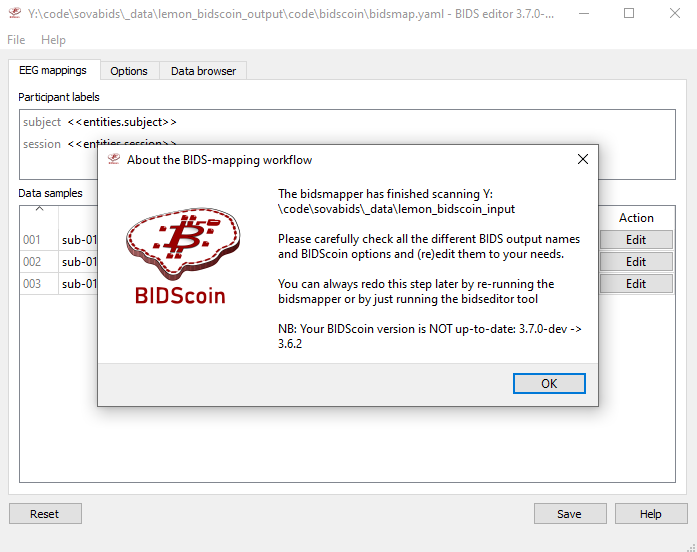
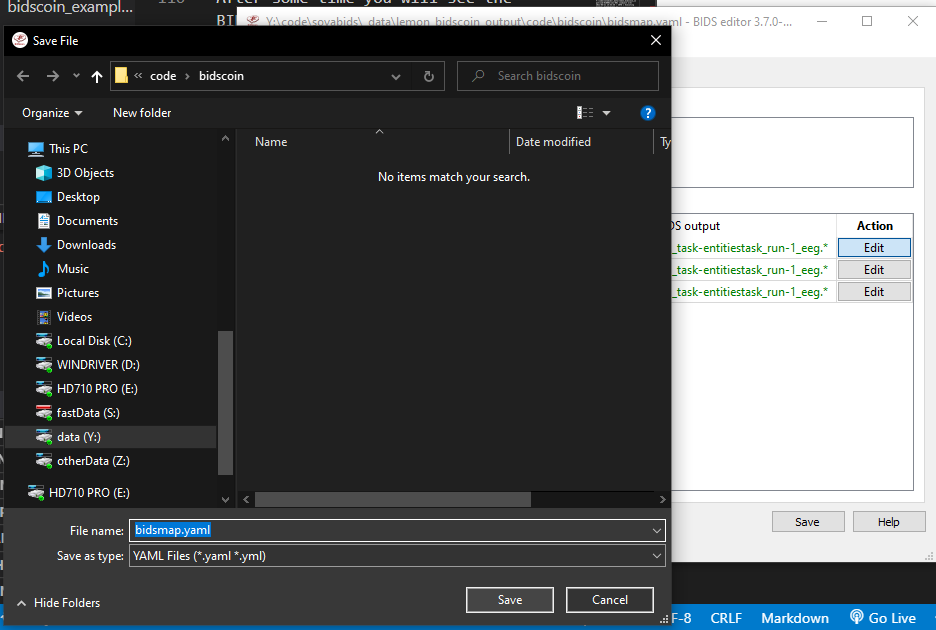
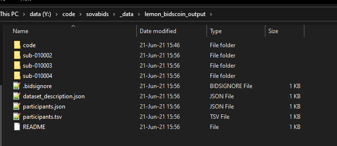

# SOVABIDS and BIDSCOIN

This integration is at a experimental stage (like SOVABIDS itself), so right now this tutorial is really "hacky"... Nevertheless it does perform a basic conversion.

## 1 Install SOVABIDS

Go to the corresponding tutorial. (docs\installing_sovabids.md)

## 2 Install our fork of bidscoin

```bash
git clone https://github.com/yjmantilla/bidscoin/tree/sovabids
cd bidscoin
pip install .
```

## Download LEMON Dataset

Run examples\lemon_prepare.py

## Prepare the dataset folder structure to accomodate to sovabids

Run examples\lemon_bidscoin_prepare.py

This will make the following folder (_data\lemon_bidscoin_input) which will be the folder we will pass bidscoin to do the conversion.

The output folder will be (_data\lemon_bidscoin_output).

## BIDSCOIN execution

Run examples\bidscoin_example.py

You should see some output of this sort, this is BIDSCOIN starting the bidsmapper.

```bash
2021-06-21 15:43:37 - INFO | 
2021-06-21 15:43:37 - INFO | -------------- START BIDSmapper ------------
2021-06-21 15:43:37 - INFO | >>> bidsmapper sourcefolder=Y:\code\sovabids\_data\lemon_bidscoin_input bidsfolder=Y:\code\sovabids\_data\lemon_bidscoin_output bidsmap=bidsmap.yaml  template=y:\code\sovabids\examples\bidscoin_example_bidsmap.yml subprefix=sub- sesprefix=ses- store=False automatic=False    
2021-06-21 15:43:37 - INFO | No existing bidsmap file found: y:\code\bidscoin\bidscoin\heuristics\bidsmap.yaml
2021-06-21 15:43:37 - INFO | Reading: y:\code\sovabids\examples\bidscoin_example_bidsmap.yml
2021-06-21 15:43:37 - WARNING | Invalid bidsmap: BIDS eeg entity sub-unknown\ses-unknown\EEG_eeg_id001 -> "recording: None" is not allowed according to 
the BIDS standard
2021-06-21 15:43:37 - INFO | Importing plugin: 'y:\code\bidscoin\bidscoin\plugins\dcm2bidsmap.py'
2021-06-21 15:43:38 - INFO | Importing plugin: 'y:\code\bidscoin\bidscoin\plugins\dcm2niix2bids.py'
2021-06-21 15:43:38 - INFO | Plugin 'y:\code\bidscoin\bidscoin\plugins\dcm2niix2bids.py' does not contain ('bidsmapper_plugin',) functions
2021-06-21 15:43:38 - INFO | Importing plugin: 'y:\code\bidscoin\bidscoin\plugins\sova2coin.py'
2021-06-21 15:43:38 - INFO | Mapping: Y:\code\sovabids\_data\lemon_bidscoin_input\sub-010002\ses-001 (subject 1/3)
2021-06-21 15:43:38 - INFO | Executing plugin: dcm2bidsmap.py
2021-06-21 15:43:38 - INFO | Importing plugin: 'y:\code\bidscoin\bidscoin\plugins\dcm2bidsmap.py'
2021-06-21 15:43:38 - INFO | Executing plugin: sova2coin.py
2021-06-21 15:43:38 - INFO | Importing plugin: 'y:\code\bidscoin\bidscoin\plugins\sova2coin.py'
2021-06-21 15:43:38 - INFO | Importing plugin: 'y:\code\bidscoin\bidscoin\plugins\sova2coin.py'
2021-06-21 15:43:39 - INFO | Found 'eeg' EEG sample: Y:\code\sovabids\_data\lemon_bidscoin_input\sub-010002\ses-001\resting\sub-010002.vhdr
2021-06-21 15:43:39 - INFO | Importing plugin: 'y:\code\bidscoin\bidscoin\plugins\dcm2niix2bids.py'
2021-06-21 15:43:39 - INFO | Mapping: Y:\code\sovabids\_data\lemon_bidscoin_input\sub-010003\ses-001 (subject 2/3)
2021-06-21 15:43:39 - INFO | Executing plugin: dcm2bidsmap.py
2021-06-21 15:43:39 - INFO | Executing plugin: sova2coin.py
2021-06-21 15:43:39 - INFO | Found 'eeg' EEG sample: Y:\code\sovabids\_data\lemon_bidscoin_input\sub-010003\ses-001\resting\sub-010003.vhdr
2021-06-21 15:43:39 - INFO | Mapping: Y:\code\sovabids\_data\lemon_bidscoin_input\sub-010004\ses-001 (subject 3/3)
2021-06-21 15:43:39 - INFO | Executing plugin: dcm2bidsmap.py
2021-06-21 15:43:39 - INFO | Executing plugin: sova2coin.py
2021-06-21 15:43:40 - INFO | Found 'eeg' EEG sample: Y:\code\sovabids\_data\lemon_bidscoin_input\sub-010004\ses-001\resting\sub-010004.vhdr
2021-06-21 15:43:40 - INFO | Opening the bidseditor
2021-06-21 15:43:41 - INFO | Importing plugin: 'y:\code\bidscoin\bidscoin\plugins\dcm2bidsmap.py'       
2021-06-21 15:43:41 - INFO | Importing plugin: 'y:\code\bidscoin\bidscoin\plugins\dcm2niix2bids.py'     
2021-06-21 15:45:59 - INFO | -------------- FINISHED! -------------------
2021-06-21 15:45:59 - INFO | 
2021-06-21 15:45:59 - INFO | The following BIDScoin errors and warnings were reported:

>>>>>>>>>>>>>>>>>>>>>>>>>>>>>>>>>>>>>>>>
2021-06-21 15:43:37 - WARNING | Invalid bidsmap: BIDS eeg entity sub-unknown\ses-unknown\EEG_eeg_id001 -> "recording: None" is not allowed according to the BIDS standard
<<<<<<<<<<<<<<<<<<<<<<<<<<<<<<<<<<<<<<<<

2021-06-21 15:45:59 - INFO | For the complete log see: Y:\code\sovabids\_data\lemon_bidscoin_output\code\bidscoin\bidsmapper.log
NB: Files in Y:\code\sovabids\_data\lemon_bidscoin_output\code\bidscoin may contain privacy sensitive information, e.g. pathnames in logfiles and provenance data samples
2021-06-21 15:45:59 - INFO | 
2021-06-21 15:45:59 - INFO | -------------- START BIDScoiner 3.7.0-dev: BIDS 1.6.0 ------------
2021-06-21 15:45:59 - INFO | >>> bidscoiner sourcefolder=Y:\code\sovabids\_data\lemon_bidscoin_input bidsfolder=Y:\code\sovabids\_data\lemon_bidscoin_output subjects=() force=False participants=False bidsmap=bidsmap.yaml
2021-06-21 15:45:59 - INFO | No existing bidsmap file found: y:\code\bidscoin\bidscoin\heuristics\bidsmap.yaml
2021-06-21 15:45:59 - ERROR | No bidsmap file found in Y:\code\sovabids\_data\lemon_bidscoin_output. Please run the bidsmapper first and/or use the correct bidsfolder

(sovabids) Y:\code\sovabids>C:/software/anaconda3/envs/sovabids/python.exe y:/code/sovabids/examples/bidscoin_example.py
2021-06-21 15:46:10 - INFO | 
2021-06-21 15:46:10 - INFO | -------------- START BIDSmapper ------------
2021-06-21 15:46:10 - INFO | >>> bidsmapper sourcefolder=Y:\code\sovabids\_data\lemon_bidscoin_input bidsfolder=Y:\code\sovabids\_data\lemon_bidscoin_output bidsmap=bidsmap.yaml  template=y:\code\sovabids\examples\bidscoin_example_bidsmap.yml subprefix=sub- sesprefix=ses- store=False automatic=False
2021-06-21 15:46:10 - INFO | No existing bidsmap file found: y:\code\bidscoin\bidscoin\heuristics\bidsmap.yaml
2021-06-21 15:46:10 - INFO | Reading: y:\code\sovabids\examples\bidscoin_example_bidsmap.yml
2021-06-21 15:46:10 - WARNING | Invalid bidsmap: BIDS eeg entity sub-unknown\ses-unknown\EEG_eeg_id001 -> "recording: None" is not allowed according to the BIDS standard
2021-06-21 15:46:10 - INFO | Importing plugin: 'y:\code\bidscoin\bidscoin\plugins\dcm2bidsmap.py'
2021-06-21 15:46:10 - INFO | Importing plugin: 'y:\code\bidscoin\bidscoin\plugins\dcm2niix2bids.py'     
2021-06-21 15:46:11 - INFO | Plugin 'y:\code\bidscoin\bidscoin\plugins\dcm2niix2bids.py' does not contain ('bidsmapper_plugin',) functions
2021-06-21 15:46:11 - INFO | Importing plugin: 'y:\code\bidscoin\bidscoin\plugins\sova2coin.py'
2021-06-21 15:46:11 - INFO | Mapping: Y:\code\sovabids\_data\lemon_bidscoin_input\sub-010002\ses-001 (subject 1/3)
2021-06-21 15:46:11 - INFO | Executing plugin: dcm2bidsmap.py
2021-06-21 15:46:11 - INFO | Importing plugin: 'y:\code\bidscoin\bidscoin\plugins\dcm2bidsmap.py'       
2021-06-21 15:46:11 - INFO | Executing plugin: sova2coin.py
2021-06-21 15:46:11 - INFO | Importing plugin: 'y:\code\bidscoin\bidscoin\plugins\sova2coin.py'
2021-06-21 15:46:11 - INFO | Importing plugin: 'y:\code\bidscoin\bidscoin\plugins\sova2coin.py'
2021-06-21 15:46:11 - INFO | Found 'eeg' EEG sample: Y:\code\sovabids\_data\lemon_bidscoin_input\sub-010002\ses-001\resting\sub-010002.vhdr
2021-06-21 15:46:11 - INFO | Importing plugin: 'y:\code\bidscoin\bidscoin\plugins\dcm2niix2bids.py'
2021-06-21 15:46:11 - INFO | Mapping: Y:\code\sovabids\_data\lemon_bidscoin_input\sub-010003\ses-001 (subject 2/3)
2021-06-21 15:46:11 - INFO | Executing plugin: dcm2bidsmap.py
2021-06-21 15:46:11 - INFO | Executing plugin: sova2coin.py
2021-06-21 15:46:12 - INFO | Found 'eeg' EEG sample: Y:\code\sovabids\_data\lemon_bidscoin_input\sub-010003\ses-001\resting\sub-010003.vhdr
2021-06-21 15:46:12 - INFO | Mapping: Y:\code\sovabids\_data\lemon_bidscoin_input\sub-010004\ses-001 (subject 3/3)
2021-06-21 15:46:12 - INFO | Executing plugin: dcm2bidsmap.py
2021-06-21 15:46:12 - INFO | Executing plugin: sova2coin.py
2021-06-21 15:46:13 - INFO | Found 'eeg' EEG sample: Y:\code\sovabids\_data\lemon_bidscoin_input\sub-010004\ses-001\resting\sub-010004.vhdr
2021-06-21 15:46:13 - INFO | Opening the bidseditor
2021-06-21 15:46:14 - INFO | Importing plugin: 'y:\code\bidscoin\bidscoin\plugins\dcm2bidsmap.py'
2021-06-21 15:46:14 - INFO | Importing plugin: 'y:\code\bidscoin\bidscoin\plugins\dcm2niix2bids.py'
```

After some time you will see the BIDSeditor GUI of BIDSCOIN starting:



Press ok

You can clik on edit to see how the details of the mapping at an individual level


You will see some fields being inferred from the files.


As of now you don't need to correct anything so just press "cancel".

Then click on 'Save' on the main window. A popup file-explorer window will open. Click 'Save' again since the filename and path are correct already.



Then you can close the window to continue the script so that the conversion is actually done (given the mapping we did).


You will start seeing some output like this:

```bash
2021-06-21 15:45:59 - INFO | -------------- START BIDScoiner 3.7.0-dev: BIDS 1.6.0 ------------
2021-06-21 15:45:59 - INFO | >>> bidscoiner sourcefolder=Y:\code\sovabids\_data\lemon_bidscoin_input bidsfolder=Y:\code\sovabids\_data\lemon_bidscoin_output subjects=() force=False participants=False bidsmap=bidsmap.yaml
2021-06-21 15:45:59 - INFO | No existing bidsmap file found: y:\code\bidscoin\bidscoin\heuristics\bidsmap.yaml
2021-06-21 15:45:59 - ERROR | No bidsmap file found in Y:\code\sovabids\_data\lemon_bidscoin_output. Please run the bidsmapper first and/or use the correct bidsfolder

(sovabids) Y:\code\sovabids>C:/software/anaconda3/envs/sovabids/python.exe y:/code/sovabids/examples/bidscoin_example.py
2021-06-21 15:46:10 - INFO | 
2021-06-21 15:46:10 - INFO | -------------- START BIDSmapper ------------
2021-06-21 15:46:10 - INFO | >>> bidsmapper sourcefolder=Y:\code\sovabids\_data\lemon_bidscoin_input bidsfolder=Y:\code\sovabids\_data\lemon_bidscoin_output bidsmap=bidsmap.yaml  template=y:\code\sovabids\examples\bidscoin_example_bidsmap.yml subprefix=sub- sesprefix=ses- store=False automatic=False
2021-06-21 15:46:10 - INFO | No existing bidsmap file found: y:\code\bidscoin\bidscoin\heuristics\bidsmap.yaml
2021-06-21 15:46:10 - INFO | Reading: y:\code\sovabids\examples\bidscoin_example_bidsmap.yml
2021-06-21 15:46:10 - WARNING | Invalid bidsmap: BIDS eeg entity sub-unknown\ses-unknown\EEG_eeg_id001 -> "recording: None" is not allowed according to the BIDS standard
2021-06-21 15:46:10 - INFO | Importing plugin: 'y:\code\bidscoin\bidscoin\plugins\dcm2bidsmap.py'
2021-06-21 15:46:10 - INFO | Importing plugin: 'y:\code\bidscoin\bidscoin\plugins\dcm2niix2bids.py'     
2021-06-21 15:46:11 - INFO | Plugin 'y:\code\bidscoin\bidscoin\plugins\dcm2niix2bids.py' does not contain ('bidsmapper_plugin',) functions
2021-06-21 15:46:11 - INFO | Importing plugin: 'y:\code\bidscoin\bidscoin\plugins\sova2coin.py'
2021-06-21 15:46:11 - INFO | Mapping: Y:\code\sovabids\_data\lemon_bidscoin_input\sub-010002\ses-001 (subject 1/3)
2021-06-21 15:46:11 - INFO | Executing plugin: dcm2bidsmap.py
2021-06-21 15:46:11 - INFO | Importing plugin: 'y:\code\bidscoin\bidscoin\plugins\dcm2bidsmap.py'       
2021-06-21 15:46:11 - INFO | Executing plugin: sova2coin.py
2021-06-21 15:46:11 - INFO | Importing plugin: 'y:\code\bidscoin\bidscoin\plugins\sova2coin.py'
2021-06-21 15:46:11 - INFO | Importing plugin: 'y:\code\bidscoin\bidscoin\plugins\sova2coin.py'
2021-06-21 15:46:11 - INFO | Found 'eeg' EEG sample: Y:\code\sovabids\_data\lemon_bidscoin_input\sub-010002\ses-001\resting\sub-010002.vhdr
2021-06-21 15:46:11 - INFO | Importing plugin: 'y:\code\bidscoin\bidscoin\plugins\dcm2niix2bids.py'
2021-06-21 15:46:11 - INFO | Mapping: Y:\code\sovabids\_data\lemon_bidscoin_input\sub-010003\ses-001 (subject 2/3)
2021-06-21 15:46:11 - INFO | Executing plugin: dcm2bidsmap.py
2021-06-21 15:46:11 - INFO | Executing plugin: sova2coin.py
2021-06-21 15:46:12 - INFO | Found 'eeg' EEG sample: Y:\code\sovabids\_data\lemon_bidscoin_input\sub-010003\ses-001\resting\sub-010003.vhdr
2021-06-21 15:46:12 - INFO | Mapping: Y:\code\sovabids\_data\lemon_bidscoin_input\sub-010004\ses-001 (subject 3/3)
2021-06-21 15:46:12 - INFO | Executing plugin: dcm2bidsmap.py
2021-06-21 15:46:12 - INFO | Executing plugin: sova2coin.py
2021-06-21 15:46:13 - INFO | Found 'eeg' EEG sample: Y:\code\sovabids\_data\lemon_bidscoin_input\sub-010004\ses-001\resting\sub-010004.vhdr
2021-06-21 15:46:13 - INFO | Opening the bidseditor
2021-06-21 15:46:14 - INFO | Importing plugin: 'y:\code\bidscoin\bidscoin\plugins\dcm2bidsmap.py'       
2021-06-21 15:46:14 - INFO | Importing plugin: 'y:\code\bidscoin\bidscoin\plugins\dcm2niix2bids.py'     
2021-06-21 15:50:25 - INFO | User is editing Y:\code\sovabids\_data\lemon_bidscoin_input\sub-010002\ses-001\resting\sub-010002.vhdr
2021-06-21 15:50:29 - INFO | User has canceled the edit
2021-06-21 15:50:40 - INFO | User is editing Y:\code\sovabids\_data\lemon_bidscoin_input\sub-010002\ses-001\resting\sub-010002.vhdr
2021-06-21 15:50:49 - INFO | User has canceled the edit
2021-06-21 15:51:00 - INFO | User is editing Y:\code\sovabids\_data\lemon_bidscoin_input\sub-010002\ses-001\resting\sub-010002.vhdr
2021-06-21 15:51:16 - INFO | User has canceled the edit
2021-06-21 15:52:32 - INFO | User is editing Y:\code\sovabids\_data\lemon_bidscoin_input\sub-010002\ses-001\resting\sub-010002.vhdr
2021-06-21 15:53:59 - INFO | User has canceled the edit
2021-06-21 15:55:32 - INFO | Writing bidsmap to: Y:\code\sovabids\_data\lemon_bidscoin_output\code\bidscoin\bidsmap.yaml
2021-06-21 15:56:34 - INFO | -------------- FINISHED! -------------------
2021-06-21 15:56:34 - INFO | 
2021-06-21 15:56:34 - INFO | The following BIDScoin errors and warnings were reported:

>>>>>>>>>>>>>>>>>>>>>>>>>>>>>>>>>>>>>>>>
2021-06-21 15:46:10 - WARNING | Invalid bidsmap: BIDS eeg entity sub-unknown\ses-unknown\EEG_eeg_id001 -> "recording: None" is not allowed according to the BIDS standard
<<<<<<<<<<<<<<<<<<<<<<<<<<<<<<<<<<<<<<<<

2021-06-21 15:56:34 - INFO | For the complete log see: Y:\code\sovabids\_data\lemon_bidscoin_output\code\bidscoin\bidsmapper.log
NB: Files in Y:\code\sovabids\_data\lemon_bidscoin_output\code\bidscoin may contain privacy sensitive information, e.g. pathnames in logfiles and provenance data samples
2021-06-21 15:56:34 - INFO | 
2021-06-21 15:56:34 - INFO | -------------- START BIDScoiner 3.7.0-dev: BIDS 1.6.0 ------------
2021-06-21 15:56:34 - INFO | >>> bidscoiner sourcefolder=Y:\code\sovabids\_data\lemon_bidscoin_input bidsfolder=Y:\code\sovabids\_data\lemon_bidscoin_output subjects=() force=False participants=False bidsmap=bidsmap.yaml
2021-06-21 15:56:34 - INFO | Reading: Y:\code\sovabids\_data\lemon_bidscoin_output\code\bidscoin\bidsmap.yaml
2021-06-21 15:56:34 - WARNING | Invalid bidsmap: BIDS eeg entity Y:\code\sovabids\_data\lemon_bidscoin_input\sub-010002\ses-001\resting\sub-010002.vhdr -> "recording: None" is not allowed according to the BIDS standard
2021-06-21 15:56:34 - WARNING | Invalid bidsmap: BIDS eeg entity Y:\code\sovabids\_data\lemon_bidscoin_input\sub-010003\ses-001\resting\sub-010003.vhdr -> "recording: None" is not allowed according to the BIDS standard
2021-06-21 15:56:34 - WARNING | Invalid bidsmap: BIDS eeg entity Y:\code\sovabids\_data\lemon_bidscoin_input\sub-010004\ses-001\resting\sub-010004.vhdr -> "recording: None" is not allowed according to the BIDS standard
2021-06-21 15:56:34 - INFO | Importing plugin: 'y:\code\bidscoin\bidscoin\plugins\dcm2bidsmap.py'       
2021-06-21 15:56:34 - INFO | Plugin 'y:\code\bidscoin\bidscoin\plugins\dcm2bidsmap.py' does not contain 
('bidscoiner_plugin',) functions
2021-06-21 15:56:34 - INFO | Importing plugin: 'y:\code\bidscoin\bidscoin\plugins\dcm2niix2bids.py'     
2021-06-21 15:56:34 - INFO | Importing plugin: 'y:\code\bidscoin\bidscoin\plugins\sova2coin.py'
2021-06-21 15:56:34 - INFO | Writing ['extra_data/'] entries to Y:\code\sovabids\_data\lemon_bidscoin_output\.bidsignore
2021-06-21 15:56:34 - INFO | ------------------- Subject 1/3 -------------------
2021-06-21 15:56:34 - INFO | Coining datasources in: Y:\code\sovabids\_data\lemon_bidscoin_input\sub-010002\ses-001
2021-06-21 15:56:34 - INFO | Executing plugin: dcm2niix2bids.py
2021-06-21 15:56:34 - INFO | No bidscoin.plugin.dcm2niix2bids sourcedata found in: Y:\code\sovabids\_data\lemon_bidscoin_input\sub-010002\ses-001
2021-06-21 15:56:34 - INFO | Executing plugin: sova2coin.py
HEY [WindowsPath('Y:/code/sovabids/_data/lemon_bidscoin_input/sub-010002/ses-001/resting')] len 1       
2021-06-21 15:56:34 - INFO | Using subid: sub-010002 and sesid ses-001 for Y:\code\sovabids\_data\lemon_bidscoin_input\sub-010002\ses-001 -> Y:\code\sovabids\_data\lemon_bidscoin_output
2021-06-21 15:56:34 - INFO | Processing: Y:\code\sovabids\_data\lemon_bidscoin_input\sub-010002\ses-001\resting\sub-010002.vhdr

Writing 'Y:\code\sovabids\_data\lemon_bidscoin_output\README'...

References
----------
Appelhoff, S., Sanderson, M., Brooks, T., Vliet, M., Quentin, R., Holdgraf, C., Chaumon, M., Mikulan, E., Tavabi, K., Höchenberger, R., Welke, D., Brunner, C., Rockhill, A., Larson, E., Gramfort, A. and Jas, 
M. (2019). MNE-BIDS: Organizing electrophysiological data into the BIDS format and facilitating their analysis. Journal of Open Source Software 4: (1896). https://doi.org/10.21105/joss.01896

Pernet, C. R., Appelhoff, S., Gorgolewski, K. J., Flandin, G., Phillips, C., Delorme, A., Oostenveld, R. (2019). EEG-BIDS, an extension to the brain imaging data structure for electroencephalography. Scientific Data, 6, 103. https://doi.org/10.1038/s41597-019-0104-8


Writing 'Y:\code\sovabids\_data\lemon_bidscoin_output\participants.tsv'...

participant_id  age     sex     hand
sub-010002      n/a     n/a     n/a

Writing 'Y:\code\sovabids\_data\lemon_bidscoin_output\participants.json'...

{
    "participant_id": {
        "Description": "Unique participant identifier"
    },
    "age": {
        "Description": "Age of the participant at time of testing",
        "Units": "years"
    },
    "sex": {
        "Description": "Biological sex of the participant",
        "Levels": {
            "F": "female",
            "M": "male"
        }
    },
    "hand": {
        "Description": "Handedness of the participant",
        "Levels": {
            "R": "right",
            "L": "left",
            "A": "ambidextrous"
        }
    }
}

Writing 'Y:\code\sovabids\_data\lemon_bidscoin_output\sub-010002\ses-001\eeg\sub-010002_ses-001_task-resting_events.tsv'...

onset   duration        trial_type      value   sample
0.0     0.0004  New Segment/    2       0
0.0     0.0004  Comment/no USB Connection to actiCAP    1       0
3.9916  0.0004  Stimulus/S  1   3       9979
6.3752  0.0004  Stimulus/S  1   3       15938
6.3848  0.0004  Stimulus/S210   5       15962

Writing 'Y:\code\sovabids\_data\lemon_bidscoin_output\dataset_description.json'...

{
    "Name": " ",
    "BIDSVersion": "1.4.0",
    "DatasetType": "raw",
    "Authors": [
        "Please cite MNE-BIDS in your publication before removing this (citations in README)"
    ]
}

Writing 'Y:\code\sovabids\_data\lemon_bidscoin_output\sub-010002\ses-001\eeg\sub-010002_ses-001_task-resting_eeg.json'...

{
    "TaskName": "resting",
    "Manufacturer": "BrainProducts",
    "PowerLineFrequency": "n/a",    
    "SamplingFrequency": 2500.0,    
    "SoftwareFilters": "n/a",       
    "RecordingDuration": 1021.9996, 
    "RecordingType": "continuous",  
    "EEGReference": "n/a",
    "EEGGround": "n/a",
    "EEGPlacementScheme": "n/a",    
    "EEGChannelCount": 62,
    "EOGChannelCount": 0,
    "ECGChannelCount": 0,
    "EMGChannelCount": 0,
    "MiscChannelCount": 0,
    "TriggerChannelCount": 0
}

Writing 'Y:\code\sovabids\_data\lemon_bidscoin_output\sub-010002\ses-001\eeg\sub-010002_ses-001_task-resting_channels.tsv'...

name    type    units   low_cutoff      high_cutoff     description     sampling_frequency             status   status_description
Fp1     EEG     µV      0.015915494309189534    1000.0  ElectroEncephaloGram                           2500.0   good    n/a
Fp2     EEG     µV      0.015915494309189534    1000.0  ElectroEncephaloGram                           2500.0   good    n/a
F7      EEG     µV      0.015915494309189534    1000.0  ElectroEncephaloGram                           2500.0   good    n/a
F3      EEG     µV      0.015915494309189534    1000.0  ElectroEncephaloGram                           2500.0   good    n/a
Fz      EEG     µV      0.015915494309189534    1000.0  ElectroEncephaloGram                           2500.0   good    n/a
Copying data files to sub-010002_ses-001_task-resting_eeg.vhdr

Writing 'Y:\code\sovabids\_data\lemon_bidscoin_output\sub-010002\ses-001\sub-010002_ses-001_scans.tsv'...

filename        acq_time
eeg/sub-010002_ses-001_task-resting_eeg.vhdr    2013-11-11T13:47:40.346211Z
Wrote Y:\code\sovabids\_data\lemon_bidscoin_output\sub-010002\ses-001\sub-010002_ses-001_scans.tsv entry with eeg\sub-010002_ses-001_task-resting_eeg.vhdr.
2021-06-21 15:56:38 - INFO | ------------------- Subject 2/3 -------------------
2021-06-21 15:56:38 - INFO | Coining datasources in: Y:\code\sovabids\_data\lemon_bidscoin_input\sub-010003\ses-001
2021-06-21 15:56:38 - INFO | Executing plugin: dcm2niix2bids.py
2021-06-21 15:56:38 - INFO | No bidscoin.plugin.dcm2niix2bids sourcedata found in: Y:\code\sovabids\_data\lemon_bidscoin_input\sub-010003\ses-001
2021-06-21 15:56:38 - INFO | Executing plugin: sova2coin.py
HEY [WindowsPath('Y:/code/sovabids/_data/lemon_bidscoin_input/sub-010003/ses-001/resting')] len 1       
2021-06-21 15:56:39 - INFO | Using subid: sub-010003 and sesid ses-001 for Y:\code\sovabids\_data\lemon_bidscoin_input\sub-010003\ses-001 -> Y:\code\sovabids\_data\lemon_bidscoin_output
2021-06-21 15:56:40 - INFO | Processing: Y:\code\sovabids\_data\lemon_bidscoin_input\sub-010003\ses-001\resting\sub-010003.vhdr

Writing 'Y:\code\sovabids\_data\lemon_bidscoin_output\participants.tsv'...

participant_id  age     sex     hand
sub-010002      n/a     n/a     n/a
sub-010003      n/a     n/a     n/a

Writing 'Y:\code\sovabids\_data\lemon_bidscoin_output\participants.json'...

{
    "participant_id": {
        "Description": "Unique participant identifier"
    },
    "age": {
        "Description": "Age of the participant at time of testing",
        "Units": "years"
    },
    "sex": {
        "Description": "Biological sex of the participant",
        "Levels": {
            "F": "female",
            "M": "male"
        }
    },
    "hand": {
        "Description": "Handedness of the participant",
        "Levels": {
            "R": "right",
            "L": "left",
            "A": "ambidextrous"
        }
    }
}

Writing 'Y:\code\sovabids\_data\lemon_bidscoin_output\sub-010003\ses-001\eeg\sub-010003_ses-001_task-resting_events.tsv'...

onset   duration        trial_type      value   sample
0.0     0.0004  New Segment/    2       0
0.0     0.0004  Comment/no USB Connection to actiCAP    1       0
10.0988 0.0004  Stimulus/S  1   3       25247
13.0396 0.0004  Stimulus/S  1   3       32599
13.0488 0.0004  Stimulus/S210   5       32622

Writing 'Y:\code\sovabids\_data\lemon_bidscoin_output\dataset_description.json'...

{
    "Name": " ",
    "BIDSVersion": "1.4.0",
    "DatasetType": "raw",
    "Authors": [
        "Please cite MNE-BIDS in your publication before removing this (citations in README)"
    ]
}

Writing 'Y:\code\sovabids\_data\lemon_bidscoin_output\sub-010003\ses-001\eeg\sub-010003_ses-001_task-resting_eeg.json'...

{
    "TaskName": "resting",
    "Manufacturer": "BrainProducts",
    "PowerLineFrequency": "n/a",
    "SamplingFrequency": 2500.0,
    "SoftwareFilters": "n/a",
    "RecordingDuration": 1007.9396,
    "RecordingType": "continuous",
    "EEGReference": "n/a",
    "EEGGround": "n/a",
    "EEGPlacementScheme": "n/a",
    "EEGChannelCount": 62,
    "EOGChannelCount": 0,
    "ECGChannelCount": 0,
    "EMGChannelCount": 0,
    "MiscChannelCount": 0,
    "TriggerChannelCount": 0
}

Writing 'Y:\code\sovabids\_data\lemon_bidscoin_output\sub-010003\ses-001\eeg\sub-010003_ses-001_task-resting_channels.tsv'...

name    type    units   low_cutoff      high_cutoff     description     sampling_frequency             status   status_description
Fp1     EEG     µV      0.015915494309189534    1000.0  ElectroEncephaloGram                           2500.0   good    n/a
Fp2     EEG     µV      0.015915494309189534    1000.0  ElectroEncephaloGram                           2500.0   good    n/a
F7      EEG     µV      0.015915494309189534    1000.0  ElectroEncephaloGram                           2500.0   good    n/a
F3      EEG     µV      0.015915494309189534    1000.0  ElectroEncephaloGram                           2500.0   good    n/a
Fz      EEG     µV      0.015915494309189534    1000.0  ElectroEncephaloGram                           2500.0   good    n/a
Copying data files to sub-010003_ses-001_task-resting_eeg.vhdr

Writing 'Y:\code\sovabids\_data\lemon_bidscoin_output\sub-010003\ses-001\sub-010003_ses-001_scans.tsv'...

filename        acq_time
eeg/sub-010003_ses-001_task-resting_eeg.vhdr    2013-09-10T10:58:55.350974Z
Wrote Y:\code\sovabids\_data\lemon_bidscoin_output\sub-010003\ses-001\sub-010003_ses-001_scans.tsv entry with eeg\sub-010003_ses-001_task-resting_eeg.vhdr.
2021-06-21 15:56:46 - INFO | ------------------- Subject 3/3 -------------------
2021-06-21 15:56:46 - INFO | Coining datasources in: Y:\code\sovabids\_data\lemon_bidscoin_input\sub-010004\ses-001
2021-06-21 15:56:46 - INFO | Executing plugin: dcm2niix2bids.py
2021-06-21 15:56:46 - INFO | No bidscoin.plugin.dcm2niix2bids sourcedata found in: Y:\code\sovabids\_data\lemon_bidscoin_input\sub-010004\ses-001
2021-06-21 15:56:46 - INFO | Executing plugin: sova2coin.py
HEY [WindowsPath('Y:/code/sovabids/_data/lemon_bidscoin_input/sub-010004/ses-001/resting')] len 1       
2021-06-21 15:56:46 - INFO | Using subid: sub-010004 and sesid ses-001 for Y:\code\sovabids\_data\lemon_bidscoin_input\sub-010004\ses-001 -> Y:\code\sovabids\_data\lemon_bidscoin_output
2021-06-21 15:56:47 - INFO | Processing: Y:\code\sovabids\_data\lemon_bidscoin_input\sub-010004\ses-001\resting\sub-010004.vhdr

Writing 'Y:\code\sovabids\_data\lemon_bidscoin_output\participants.tsv'...

participant_id  age     sex     hand
sub-010002      n/a     n/a     n/a
sub-010003      n/a     n/a     n/a
sub-010004      n/a     n/a     n/a

Writing 'Y:\code\sovabids\_data\lemon_bidscoin_output\participants.json'...

{
    "participant_id": {
        "Description": "Unique participant identifier"
    },
    "age": {
        "Description": "Age of the participant at time of testing",
        "Units": "years"
    },
    "sex": {
        "Description": "Biological sex of the participant",
        "Levels": {
            "F": "female",
            "M": "male"
        }
    },
    "hand": {
        "Description": "Handedness of the participant",
        "Levels": {
            "R": "right",
            "L": "left",
            "A": "ambidextrous"
        }
    }
}

Writing 'Y:\code\sovabids\_data\lemon_bidscoin_output\sub-010004\ses-001\eeg\sub-010004_ses-001_task-resting_events.tsv'...

onset   duration        trial_type      value   sample
0.0     0.0004  New Segment/    2       0
0.0     0.0004  Comment/actiCAP Data On 1       0
7.1968  0.0004  Stimulus/S  1   3       17992
10.3628 0.0004  Stimulus/S  1   3       25907
10.372  0.0004  Stimulus/S210   5       25930

Writing 'Y:\code\sovabids\_data\lemon_bidscoin_output\dataset_description.json'...

{
    "Name": " ",
    "BIDSVersion": "1.4.0",
    "DatasetType": "raw",
    "Authors": [
        "Please cite MNE-BIDS in your publication before removing this (citations in README)"
    ]
}

Writing 'Y:\code\sovabids\_data\lemon_bidscoin_output\sub-010004\ses-001\eeg\sub-010004_ses-001_task-resting_eeg.json'...

{
    "TaskName": "resting",
    "Manufacturer": "BrainProducts",
    "PowerLineFrequency": "n/a",
    "SamplingFrequency": 2500.0,
    "SoftwareFilters": "n/a",
    "RecordingDuration": 1022.0396,
    "RecordingType": "continuous",
    "EEGReference": "n/a",
    "EEGGround": "n/a",
    "EEGPlacementScheme": "n/a",
    "EEGChannelCount": 62,
    "EOGChannelCount": 0,
    "ECGChannelCount": 0,
    "EMGChannelCount": 0,
    "MiscChannelCount": 0,
    "TriggerChannelCount": 0
}

Writing 'Y:\code\sovabids\_data\lemon_bidscoin_output\sub-010004\ses-001\eeg\sub-010004_ses-001_task-resting_channels.tsv'...

name    type    units   low_cutoff      high_cutoff     description     sampling_frequency             status   status_description
Fp1     EEG     µV      0.015915494309189534    1000.0  ElectroEncephaloGram                           2500.0   good    n/a
Fp2     EEG     µV      0.015915494309189534    1000.0  ElectroEncephaloGram                           2500.0   good    n/a
F7      EEG     µV      0.015915494309189534    1000.0  ElectroEncephaloGram                           2500.0   good    n/a
F3      EEG     µV      0.015915494309189534    1000.0  ElectroEncephaloGram                           2500.0   good    n/a
Fz      EEG     µV      0.015915494309189534    1000.0  ElectroEncephaloGram                           2500.0   good    n/a
Copying data files to sub-010004_ses-001_task-resting_eeg.vhdr

Writing 'Y:\code\sovabids\_data\lemon_bidscoin_output\sub-010004\ses-001\sub-010004_ses-001_scans.tsv'...

filename        acq_time
eeg/sub-010004_ses-001_task-resting_eeg.vhdr    2013-11-15T13:54:17.255858Z
Wrote Y:\code\sovabids\_data\lemon_bidscoin_output\sub-010004\ses-001\sub-010004_ses-001_scans.tsv entry with eeg\sub-010004_ses-001_task-resting_eeg.vhdr.
2021-06-21 15:56:58 - INFO | -------------- FINISHED! ------------
2021-06-21 15:56:58 - INFO | 
2021-06-21 15:56:58 - INFO | The following BIDScoin errors and warnings were reported:

>>>>>>>>>>>>>>>>>>>>>>>>>>>>>>>>>>>>>>>>
2021-06-21 15:46:10 - WARNING | Invalid bidsmap: BIDS eeg entity sub-unknown\ses-unknown\EEG_eeg_id001 -> "recording: None" is not allowed according to the BIDS standard
2021-06-21 15:56:34 - WARNING | Invalid bidsmap: BIDS eeg entity Y:\code\sovabids\_data\lemon_bidscoin_input\sub-010002\ses-001\resting\sub-010002.vhdr -> "recording: None" is not allowed according to the BIDS standard
2021-06-21 15:56:34 - WARNING | Invalid bidsmap: BIDS eeg entity Y:\code\sovabids\_data\lemon_bidscoin_input\sub-010003\ses-001\resting\sub-010003.vhdr -> "recording: None" is not allowed according to the BIDS standard
2021-06-21 15:56:34 - WARNING | Invalid bidsmap: BIDS eeg entity Y:\code\sovabids\_data\lemon_bidscoin_input\sub-010004\ses-001\resting\sub-010004.vhdr -> "recording: None" is not allowed according to the BIDS standard
<<<<<<<<<<<<<<<<<<<<<<<<<<<<<<<<<<<<<<<<

2021-06-21 15:56:58 - INFO | The following BIDScoin errors and warnings were reported:

>>>>>>>>>>>>>>>>>>>>>>>>>>>>>>>>>>>>>>>>
2021-06-21 15:56:34 - WARNING | Invalid bidsmap: BIDS eeg entity Y:\code\sovabids\_data\lemon_bidscoin_input\sub-010002\ses-001\resting\sub-010002.vhdr -> "recording: None" is not allowed according to the BIDS standard
2021-06-21 15:56:34 - WARNING | Invalid bidsmap: BIDS eeg entity Y:\code\sovabids\_data\lemon_bidscoin_input\sub-010003\ses-001\resting\sub-010003.vhdr -> "recording: None" is not allowed according to the BIDS standard
2021-06-21 15:56:34 - WARNING | Invalid bidsmap: BIDS eeg entity Y:\code\sovabids\_data\lemon_bidscoin_input\sub-010004\ses-001\resting\sub-010004.vhdr -> "recording: None" is not allowed according to the BIDS standard
<<<<<<<<<<<<<<<<<<<<<<<<<<<<<<<<<<<<<<<<

2021-06-21 15:56:58 - INFO | For the complete log see: Y:\code\sovabids\_data\lemon_bidscoin_output\code\bidscoin\bidscoiner.log
NB: Files in Y:\code\sovabids\_data\lemon_bidscoin_output\code\bidscoin may contain privacy sensitive information, e.g. pathnames in logfiles and provenance data samples
```

Once finished you can go to the output folder (_data\lemon_bidscoin_output) for the converted data.

