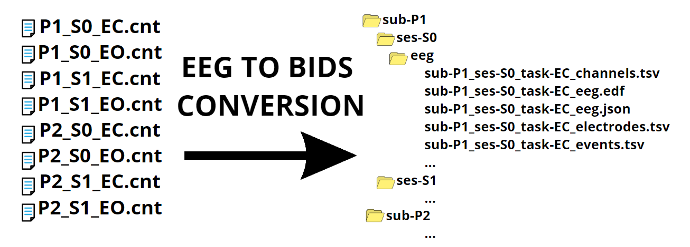
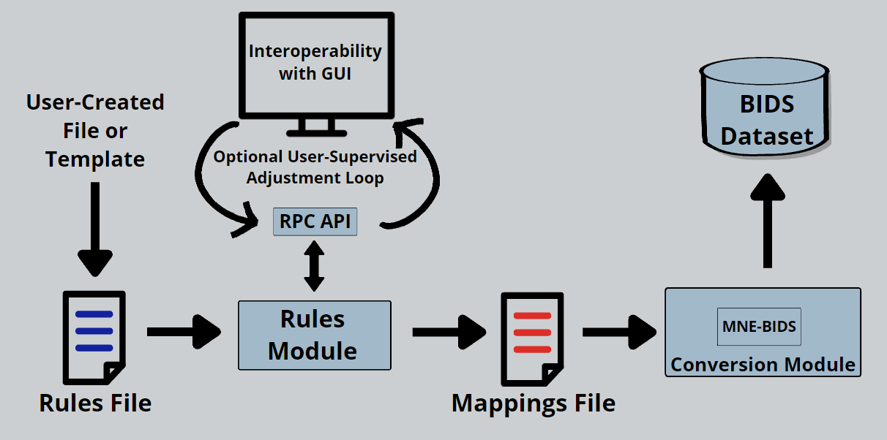

# Summary

SOVABIDS enables the reproducible semi-automatic and interoperable conversion of EEG datasets into the Brain Imaging Data Structure standard (BIDS). In essence, BIDS is a way of organizing the files of a neuroimaging study into a folder hierarchy along with sidecar metadata files. SOVABIDS accomplishes the conversion through the use of human-readable configuration files, and in this way make BIDS more accessible to non-technical users and drastically reduces the human effort required for the conversion of datasets. Graphically, we can summarize the main use of SOVABIDS with figure \autoref{fig:use}. SOVABIDS provides [API documentation](https://sovabids.readthedocs.io/en/latest/autoapi/index.html) and [usage examples](https://sovabids.readthedocs.io/en/latest/auto_examples/index.html). Furthermore, SOVABIDS has become a part of the [AEDAPT ecosystem](www.aedapt.net).

# Statement of need

The Brain Imaging Data Structure (BIDS) is a standard for organising the data and meta data produced by a neuroimaging experiment [@bids]. It helps with data sharing and reusability. It has recently gained popularity within the electroencephalography (EEG) community [@eegbids]. Converting EEG data to BIDS is not technically difficult but involves substantial effort if done manually. Software options are available to assist the conversion, but they require either basic programming skills (e.g. MNE-BIDS [@mnebids]) or detailed user input (e.g. [@eeg2bids]). Given this, SOVABIDS was designed with the following constraints and solutions in mind:

## Adoption by non-technical users

To maximise software adoption, step-by-step guides are provided. To decrease the need of programming skills the conversion uses human-readable YAML configuration files rather than a scripting language.

## Automation and the handling of outliers

The output of most EEG experiments is multiple identically-organised data structures (one for each participant). Nevertheless, data organisation may slightly differ between participants. We leverage the generally similar organisation while still allowing for outliers by using two configuration files: 1) The Rules File, which encodes the general conversion rules for an EEG dataset; and 2) The Mappings File, which is derived from the Rules File, and holds specific conversion rules for every individual participant (Fig. \autoref{fig:cfg}). For increased automation, SOVABIDS also implements heuristics to exploit the common file path patterns used in EEG research.

## Reproducible conversion

All the parameters needed to fully replicate the conversion are saved in the configuration files along with provenance information. This allows the user to evaluate, correct and repeat the conversion in case problems are discovered during data analysis.

## Interoperability

To increase maintainability, SOVABIDS does not include a graphical user interface (GUI), but has been provided with an API to allow interoperability with other applications, primarily GUI front ends (desktop or web-based). We used an RPC protocol as action-oriented methods naturally adjust to a conversion process. To demonstrate the usability of the API, a [basic GUI was developed in Flask](sovabids.readthedocs.io/en/latest/auto_examples/gui_example.html).

## Broad support of formats and reusing available software

MNE [@mne] supports a broad collection of EEG formats and MNE-BIDS [@mnebids] is already capable of performing conversion albeit using detailed input and scripting from a technical user. Both packages were selected as ideal building-blocks for SOVABIDS.

# Software Architecture

[SOVABIDS](sovabids.readthedocs.io) comprises two main modules: 1) A rules module to encode and interpret the rules of the conversion, and 2) a module interfacing with MNE-BIDS to execute the conversion (Fig. \autoref{fig:arch}). Currently, it has been tested with BrainVision (.vhdr) and Neuroscan (.cnt) files. The user can derive the initial Rules File from a community or institutional template. A user-supervised adjustment loop is then included to allow manual input when fully automated generation of a participant-specific Mappings File is not possible.

# Acknowledgements

We acknowledge the support from the 2021 Google Summer of Code program under the International Neuroinformatics Coordinating Facility (INCF) organization, and by the Australian Research Data Commons (ARDC) initiative.

# References