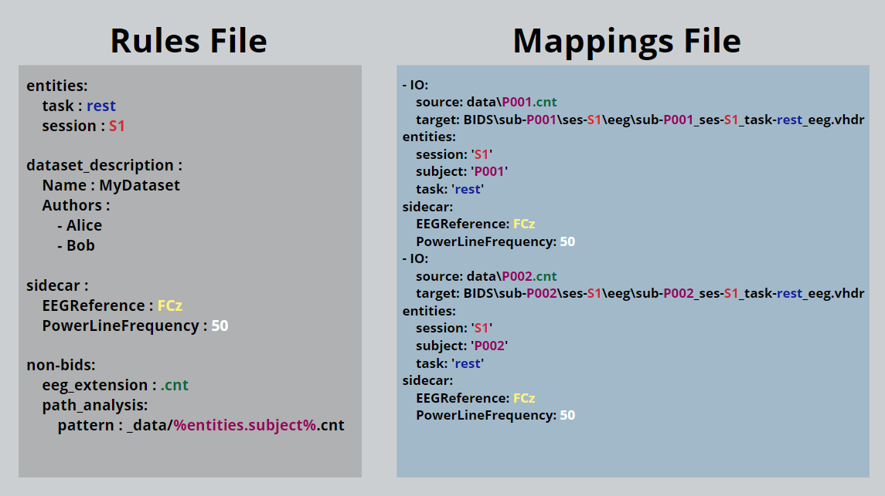

# Summary

EEG data is used in many fields, from neuroscience to clinical research, but it often comes in different formats and structures, making it hard to organize, share, or compare across studies. SOVABIDS is an open-source tool that helps researchers convert EEG data into the Brain Imaging Data Structure (BIDS) [@bids], a standard format that makes data more structured and easier to work with (\autoref{fig:use} illustrates this conversion process). This transformation ensures that datasets remain organized and easier to analyze across different studies.
Rather than manually renaming files or reorganizing folders, SOVABIDS allows users to define simple rules to automate the conversion. The tool is designed to be flexible and user-friendly, supporting customization without requiring advanced programming skills. It can be used as a Python package or as a command-line tool, and includes [comprehensive documentation](https://sovabids.readthedocs.io/en/latest/README.html) with [tutorials](https://sovabids.readthedocs.io/en/latest/auto_examples/index.html) to help users get started. SOVABIDS also integrates with other tools, making it suitable for both small research projects and large collaborative studies.

![Illustration of the EEG to BIDS conversion. The left side shows raw EEG files with participant-specific naming conventions (e.g., P1_S0_EC.cnt), where P1 and P2 represent participants, S0 and S1 indicate sessions, and EC (Eyes Closed) and EO (Eyes Open) refer to tasks. These raw files are converted into the BIDS format, shown on the right, where data is systematically organized into subject (sub-), session (ses-), and modality (eeg) folders. Each EEG recording is saved in standardized BIDS-compliant formats, including .edf for EEG signals and .tsv/.json for metadata. This structure ensures consistency, making it easier to analyze, share, and integrate EEG data across studies. \label{fig:use}](main-use.png)

# Statement of need

Electroencephalography (EEG) is a widely used neuroimaging technique that provides high temporal resolution for studying brain activity. Its applications span numerous fields, including cognitive neuroscience, clinical diagnostics, brain-computer interfaces, and neuroengineering. With the increasing volume and complexity of EEG data, ensuring reproducibility, standardization, and interoperability has become a growing priority in the field. The Brain Imaging Data Structure for EEG (EEG-BIDS) [@eegbids] provides a consistent framework for organizing EEG datasets, facilitating data sharing [@openneuro], large-scale collaborations, cross-study comparisons, and promoting FAIR data practices [@fairdata] across a wide range of research applications from fundamental cognitive neuroscience to large-scale clinical neuroimaging.
The datasets generated in studies using electroencephalography (EEG) are not only large and complex, but also vary widely due to the multitude of formats used by different hardware vendors. Thus, despite the advantages of BIDS, the conversion of EEG datasets to the BIDS standard can be challenging, especially for researchers who are not well-versed in technical data manipulation, and those from smaller or less well-resourced institutions. Researchers are thus obliged to wrestle with converting their data to BIDS following data acquisition. This process is prone to error if done manually, which poses particular problems for large studies. Software solutions are available to assist the conversion, but they require either basic programming skills -e.g. MNE-BIDS [@mnebids], data2bids in FieldTrip [@fieldtrip] and EEG-BIDS in EEGLAB [@eeglab]-, or detailed user input for each file being converted, again limiting practicality for large studies -e.g. EEG2BIDS [@eeg2bids]-.

SOVABIDS addresses this challenge by enabling reproducible semi-automatic and interoperable conversion of EEG datasets into the BIDS standard, even by non-technical users. This democratizes access to BIDS compliance, enabling more EEG data to be shared and analyzed within the broader scientific community. Moreover, SOVABIDS facilitates the development of user-friendly graphical frontends, which further enhances its accessibility to a wider audience, including those who may not be familiar with programming or data structuring concepts. SOVABIDS leverages established EEG analysis tools such as MNE [@mne] for reading EEG data formats and MNE-BIDS [@mnebids] for BIDS compliant data saving. It also incorporates open-source best practices such as automated testing and [streamlined documentation](https://sovabids.readthedocs.io/en/latest/autoapi/index.html) that includes [usage examples](https://sovabids.readthedocs.io/en/latest/auto_examples/index.html), ensuring continuous enhancement, and facilitating community usage and collaboration in maintaining and improving the software.

SOVABIDS is currently available on the Neurodesk platform (www.neurodesk.org) [@neurodesk]. It has been used in both academic research and published scientific studies, including a Master’s thesis on EEG-based Alzheimer’s risk classification [@vero], a Bachelor’s thesis on web-based EEG processing tools [@luisa], and a peer-reviewed study on EEG harmonization using ComBat models [@alberto].

# Core Features and Design Principles

Developing an EEG-to-BIDS conversion tool requires balancing usability, automation, reproducibility, and flexibility while ensuring compatibility with existing neuroimaging tools. SOVABIDS was designed with these challenges in mind, prioritizing accessibility for non-technical users, handling variations in EEG data structures, and enabling seamless integration with other software. The following five design principles guided its development:

## 1. Adoption by non-technical users
To decrease the need of programming skills, the conversion uses human-readable and writable YAML configuration files rather than a scripting language. This approach was inspired by Bidscoin [@bidscoin], a BIDS converter for MRI data. To maximise software adoption, step-by-step guides for SOVABIDS are provided.

## 2. Automation that can accommodate outliers
The planned output of EEG experiments is usually multiple identically-organised data structures,  typically one for each participant. Nevertheless, in practice data organisation often varies slightly between participants; for example, due to temporary technical issues, the data recorded for some participants might be partial or have repeated segments. Similar to other conversion tools [@bidscoin][@heudi], we leverage the generally similar data organisation across participants, but we extend this by allowing for non-identical data structures. This is done by utilising two configuration files (which are illustrated on \autoref{fig:cfg}):

- The [Rules File](https://sovabids.readthedocs.io/en/latest/rules_schema.html), which encodes the general conversion rules for a multiple-participant EEG dataset.
- The [Mappings File](https://sovabids.readthedocs.io/en/latest/mappings_schema.html), which is derived from the Rules File, and holds specific conversion rules for every individual participant.

In addition, the user can derive the initial Rules File from a community or institutional template, further decreasing manual input. For more fine-tuning of special cases, a user-supervised adjustment loop can be set up through the interoperable API to connect with an external GUI, allowing for fast manual inputs when a fully automated generation is not possible.

For increased automation, SOVABIDS implements heuristics to exploit the common file path patterns used in EEG research. Unlike tools that rely on strict prefix-based identification -e.g., “--sub-prefix” and “--ses-prefix” in Bidscoin [@bidscoin] and Bidsme [@bidsme]-, SOVABIDS allows users to extract metadata flexibly from EEG file paths -e.g. also extracting the task and other BIDS properties instead of only session and subject-. This can be done through:

- Regex patterns for advanced users.
- Placeholder-based templates for intuitive rule definition (as illustrated to the left of \autoref{fig:cfg} under “path_analysis”).
- Paired source-target examples for users unfamiliar with regex or placeholders.

## 3. Reproducible conversion

All the parameters needed to fully replicate the conversion are saved in the configuration files along with provenance information. This allows the user to evaluate, correct and repeat the conversion in case the BIDS-organised dataset has an invalid structure (as detected using a BIDS validator) or incorrect content (usually discovered during the analysis stage).

## 4. Interoperability

To increase maintainability, SOVABIDS does not include a graphical user interface (GUI), but its API allows interoperability with other applications, primarily GUI front ends (desktop or web-based). We used an RPC protocol, as action-oriented methods naturally align with the conversion process. Additionally, interoperability is enhanced through YAML-based configuration files, which allow users to define conversion rules in a structured, human-readable format. This enables seamless integration with other tools while minimizing the need for direct coding. To [demonstrate](https://www.youtube.com/watch?v=PW84cy6uUJs) the usability of the API, a [basic GUI was developed in Flask](https://sovabids.readthedocs.io/en/latest/auto_examples/gui_example.html).

## 5. Broad support of formats
SOVABIDS is designed to convert EEG datasets into the BIDS standard while accommodating diverse data formats. Since it relies on MNE-Python for reading electrophysiology files, any format supported by MNE can be processed and converted. As of now, the software has been specifically tested with BrainVision (.vhdr) and Neuroscan (.cnt) files, but it can be used with other EEG formats that MNE supports.

# Software Architecture

The software architecture of [SOVABIDS](https://github.com/yjmantilla/sovabids/blob/main/paper/sovabids.readthedocs.io) is designed to streamline the process of converting EEG datasets to the BIDS format. As depicted in \autoref{fig:arch}, the system is built around two core modules that work in tandem to simplify this complex task:

- Rules Module: At the heart of SOVABIDS, the Rules Module is where the logic of conversion is enacted. Users define specific rules in the ‘Rules File’, which the module applies to target EEG files, extracting and compiling conversion parameters into a 'Mappings File'. This ‘Mappings File’ becomes the blueprint for the subsequent data transformation process, ensuring that the individualized nuances of each EEG file are accounted for. These nuances can be introduced through manual editing or through the interoperation with GUIs by leveraging the RPC API.
- Conversion Module: Acting upon the 'Mappings File', this module is responsible for the hands-on task of converting raw EEG data into the BIDS format. It’s a crucial step that translates the preparatory work done by the Rules Module into a structured dataset aligned with the stringent requirements of the BIDS standard, allowing for better interoperability and reproducibility of research.

![The architecture of SOVABIDS. The conversion process starts with a user-defined Rules File, which encodes general conversion rules (represented in blue inside the Rules File). The Rules Module processes these rules to generate a Mappings File, which contains specific configurations for all EEG files (each red line in the Mappings File represents the configuration of a different EEG file). The Conversion Module then applies these configurations to produce a BIDS-compliant dataset. Interoperability is enabled via an RPC API, allowing integration with external tools, including graphical user interfaces (GUIs) for optional user-supervised adjustments.\label{fig:arch}](arch.png)

# Acknowledgements

The authors acknowledge the support from the 2021 Google Summer of Code program under the International Neuroinformatics Coordinating Facility (INCF) organization, and by the Australian Research Data Commons (ARDC). The authors also acknowledge the facilities and scientific and technical assistance of the National Imaging Facility, a National Collaborative Research Infrastructure Strategy (NCRIS) capability, at Swinburne Neuroimaging, Swinburne University of Technology, and at the Centre for Advanced Imaging, The University of Queensland, and funding provided by the Australian Research Data Commons to support the Australian Electrophysiology Data Analytics Platform (AEDAPT).

# References