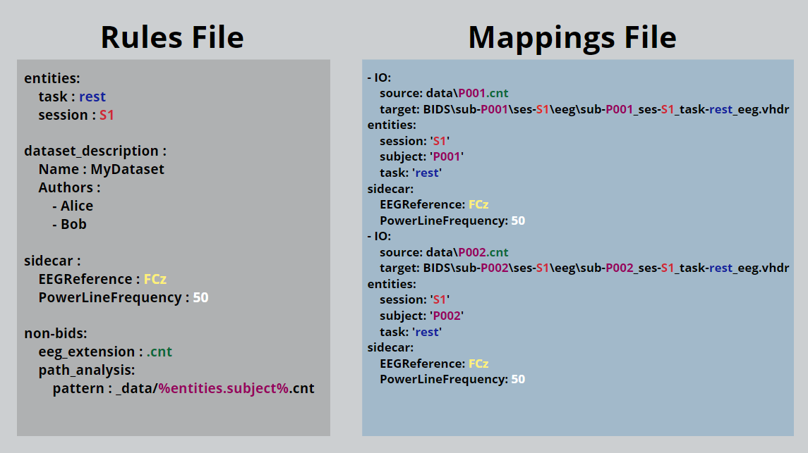

# Summary

Electroencephalography (EEG) data are used in many fields, from neuroscience to clinical research, but recordings are stored in a wide variety of formats and lab-specific folder structures, making them difficult to organize, share, or compare across studies. SOVABIDS is an open-source tool that helps researchers convert EEG data into the Brain Imaging Data Structure (BIDS) [@bids], a standard that promotes FAIR data practices (Findability, Accessibility, Interoperability, and Reusability) and is increasingly expected for data sharing and large-scale collaboration. Rather than manually renaming files or writing dataset-specific scripts, SOVABIDS allows users to define conversion rules in human-readable YAML configuration files, which are then applied automatically across all participants in a dataset (\autoref{fig:use} illustrates this process). The tool is usable as a Python package or command-line tool, and its API supports integration with graphical frontends for users who prefer a visual interface. Comprehensive documentation and tutorials are available at [sovabids.readthedocs.io](https://sovabids.readthedocs.io/en/latest/README.html).

![Illustration of the EEG to BIDS conversion. The left side shows raw EEG files with participant-specific naming conventions (for example, P1_S0_EC.cnt), where P1 and P2 represent participants, S0 and S1 indicate sessions, and EC (Eyes Closed) and EO (Eyes Open) refer to tasks. These raw files are converted into the BIDS format, shown on the right, where data are systematically organized into subject (sub-), session (ses-), and modality (eeg) folders. Each EEG recording is saved in standardized BIDS-compliant formats, including .edf for EEG signals and .tsv/.json for metadata. \label{fig:use}](main-use.png)

# Statement of need

Electroencephalography is a widely used neuroimaging technique that provides high temporal resolution for studying brain activity. Its applications span numerous fields, including cognitive neuroscience, clinical diagnostics, brain-computer interfaces, and neuroengineering. With the increasing volume and complexity of EEG data, ensuring reproducibility, standardization, and interoperability has become a growing priority in the field. The Brain Imaging Data Structure for EEG (EEG-BIDS) [@eegbids] provides a consistent framework for organizing EEG datasets, facilitating data sharing [@openneuro], large-scale collaborations, cross-study comparisons, and promoting FAIR data practices [@fairdata] across a wide range of research applications from fundamental cognitive neuroscience to large-scale clinical neuroimaging.

Despite these advantages, converting EEG datasets to BIDS in practice remains a significant challenge. EEG data varies widely in format due to the multitude of proprietary standards used by different hardware vendors, and datasets are often organized according to lab-specific or acquisition-driven conventions rather than any consistent structure. For researchers without strong programming backgrounds, particularly those at smaller or less well-resourced institutions, this conversion process typically requires either substantial manual effort or the ability to write dataset-specific scripts, both of which are error-prone and difficult to reproduce or scale to large multi-participant studies. SOVABIDS addresses this gap by providing a rule-based, semi-automated conversion workflow that is accessible to non-programmers while remaining flexible enough to handle the heterogeneity common in real-world EEG datasets.

# State of the Field

Several tools support EEG conversion to BIDS, including MNE-BIDS [@mnebids], data2bids in FieldTrip [@fieldtrip], EEG-BIDS in EEGLAB [@eeglab], and EEG2BIDS [@eeg2bids]. More general-purpose converters such as Bidsme [@bidsme] also support EEG alongside other modalities.

MNE-BIDS [@mnebids] provides a powerful programmatic interface within the MNE ecosystem and offers fine-grained control over metadata specification. However, it typically requires dataset-specific scripting, which limits accessibility for non-technical users and reduces scalability for large multi-participant studies.

FieldTrip [@fieldtrip] and EEGLAB [@eeglab] provide conversion utilities integrated within their respective analysis environments. While convenient for users already embedded in those ecosystems, conversion workflows often require manual interaction or scripting for each dataset.

EEG2BIDS [@eeg2bids] offers a more guided workflow but relies on detailed user input at the file level, which becomes impractical for large heterogeneous datasets.

Bidsme [@bidsme] is a general-purpose converter that assumes datasets are already organized in a structured hierarchy prior to conversion. While effective when data are consistently arranged, many EEG datasets are stored using vendor-specific naming schemes or lab-driven folder structures that do not conform to any standard hierarchy. In such cases, substantial manual reorganization is required before conversion can begin.

A natural question is whether SOVABIDS' goals could have been achieved by contributing to an existing tool, particularly MNE-BIDS. We argue they could not. MNE-BIDS is designed around a scripting paradigm where conversion logic is expressed in Python code. Adding rule-based, configuration-driven automation as a non-breaking extension would require architectural changes that diverge from MNE-BIDS’ current scripting-oriented design philosophy and typical usage patterns. The same barrier applies to FieldTrip and EEGLAB, where conversion is tightly coupled to their respective analysis environments.

SOVABIDS instead introduces a distinct approach: an explicit two-tier separation between dataset-level rules and participant-level mappings, encoded in human-readable YAML configuration files. This separation enables automated propagation of general conversion logic while systematically capturing participant-specific deviations without requiring any scripting. Combined with flexible metadata extraction from arbitrary file paths, this design allows SOVABIDS to handle the heterogeneous directory structures and vendor-specific naming conventions common in real-world EEG datasets, while remaining accessible to researchers without programming experience. It also preserves full provenance, enabling reproducible and auditable conversion workflows.

# Software Design

Developing an EEG-to-BIDS conversion tool requires balancing usability, automation, reproducibility, and flexibility while ensuring compatibility with existing neuroimaging tools. The central design tension in SOVABIDS is between expressiveness and accessibility: more powerful conversion logic typically requires programming skill, while simpler interfaces tend to sacrifice flexibility. The following five design principles reflect the trade-offs made to resolve this tension.

## 1. Accessibility for non-technical users

A scripting-based interface, as used by tools like MNE-BIDS, offers maximum expressiveness but requires users to write and maintain dataset-specific code. We traded this expressiveness for accessibility by using human-readable YAML configuration files instead. This approach was inspired by Bidscoin [@bidscoin], a BIDS converter for MRI data. The trade-off is that highly unusual conversion scenarios may require more verbose configuration, but for the vast majority of EEG datasets the YAML-based approach is sufficient and considerably more approachable. To further lower the barrier to adoption, step-by-step guides and usage examples are provided in the documentation.

## 2. Automation that can accommodate outliers

EEG experiments typically produce multiple identically-organised datasets, one per participant. In practice, however, data organisation often varies slightly between participants due to technical issues, partial recordings, or repeated segments. A fully automated system that assumes identical structure across participants would silently fail in these cases, while a fully manual system would not scale. SOVABIDS resolves this by separating conversion logic into two configuration files (illustrated in \autoref{fig:cfg}):

- The [Rules File](https://sovabids.readthedocs.io/en/latest/rules_schema.html), which encodes general conversion rules for the full dataset.
- The [Mappings File](https://sovabids.readthedocs.io/en/latest/mappings_schema.html), derived from the Rules File, which holds specific conversion parameters for every individual file.

This two-tier approach, inspired by tools such as Bidscoin [@bidscoin] and HeuDiConv [@heudi] (both focused on MRI), extends their model by explicitly supporting non-identical participant structures. Users can also derive an initial Rules File from a community or institutional template to further reduce manual input, and can connect an external GUI via SOVABIDS' API for supervised adjustment of edge cases where full automation is not possible.

To support flexible metadata extraction, SOVABIDS implements heuristics based on common EEG file path patterns. Rather than requiring data to be pre-organized into a standard folder hierarchy before conversion can begin, as both Bidscoin and Bidsme do, SOVABIDS can extract subject, session, task, and other BIDS-relevant properties from arbitrary file paths through flexible pattern matching. This is supported through three approaches of increasing technicality: paired source-target examples for users unfamiliar with pattern matching, placeholder-based templates for intermediate users, and full regular expressions for advanced users who need precise control.

## 3. Reproducible conversion

Reproducibility requires that the full conversion be re-runnable from saved state alone, without relying on the user's memory or undocumented manual steps. All parameters needed to replicate a conversion are therefore saved in the configuration files alongside provenance information. This allows users to audit, correct, and re-run conversions when a BIDS validator flags structural issues or when downstream analysis reveals incorrect metadata.

## 4. Interoperability without a built-in GUI

Including a graphical user interface directly in SOVABIDS would simplify initial use but would tightly couple the tool to a specific frontend technology, increasing maintenance burden and limiting integration with other platforms. Instead, SOVABIDS exposes an RPC-based API that allows any external application — desktop, web-based, or platform-specific — to interact with its conversion logic. RPC was chosen over REST because its action-oriented design maps naturally onto the procedural steps of a data conversion workflow. To demonstrate the API's usability, a [reference GUI was developed in Flask](https://sovabids.readthedocs.io/en/latest/auto_examples/gui_example.html) and is available as a working [example](https://www.youtube.com/watch?v=PW84cy6uUJs).

## 5. Format support through MNE delegation

Supporting the full range of EEG hardware formats from scratch would be an ongoing maintenance burden disproportionate to the tool's core contribution. SOVABIDS instead delegates file reading entirely to MNE-Python [@mne], and BIDS-compliant saving to MNE-BIDS [@mnebids], inheriting support for all formats those libraries handle. The trade-off is that SOVABIDS' format coverage is bounded by MNE's, but this is an acceptable constraint given MNE's broad and actively maintained format support. In practice, SOVABIDS has been specifically tested with BrainVision (.vhdr) and Neuroscan (.cnt) files.

## Architecture Overview

The five design principles above are reflected directly in SOVABIDS' two-module architecture, illustrated in \autoref{fig:arch}. The Rules Module takes the user-defined Rules File and applies it across all EEG files in the dataset, extracting conversion parameters and compiling them into a Mappings File. This separation means that general conversion logic and participant-specific details are handled in distinct, inspectable artifacts rather than embedded in code. The Conversion Module then reads the Mappings File and performs the actual transformation to BIDS-compliant output, delegating file reading to MNE and BIDS-compliant saving to MNE-BIDS. At either stage, the RPC API allows external tools and GUIs to inspect or modify the configuration, supporting the supervised adjustment workflows described above.

![The architecture of SOVABIDS. The conversion process starts with a user-defined Rules File, which encodes general conversion rules (represented in blue inside the Rules File). The Rules Module processes these rules to generate a Mappings File, which contains specific configurations for all EEG files (each red line in the Mappings File represents the configuration of a different EEG file). The Conversion Module then applies these configurations to produce a BIDS-compliant dataset. Interoperability is enabled via an RPC API, allowing integration with external tools, including graphical user interfaces for optional user-supervised adjustments.\label{fig:arch}](arch.png)

# Research Impact Statement

SOVABIDS is listed in the [official BIDS converter registry under the EEG/MEEG/iEEG category](https://bids.neuroimaging.io/tools/converters.html), reflecting recognition by the broader BIDS community. It is also available on the Neurodesk platform [www.neurodesk.org](www.neurodesk.org) [@neurodesk], a community-maintained open neuroimaging environment, which broadens its accessibility beyond the developing team.

Its use has been documented in peer-reviewed and academic work: a Master's thesis on EEG-based Alzheimer's risk classification [@vero], a Bachelor's thesis on web-based EEG processing tools [@luisa], and a peer-reviewed study on harmonizing EEG features across multiple recording sites [@alberto]. These use cases reflect SOVABIDS' applicability across different research scales, from individual thesis projects to multi-site data harmonization studies.

# Acknowledgements

The authors acknowledge the support from the 2021 Google Summer of Code program under the International Neuroinformatics Coordinating Facility (INCF) organization, and the funding provided by the Australian Research Data Commons (ARDC) to support the Australian Electrophysiology Data Analytics Platform (AEDAPT). The authors also acknowledge the facilities and the scientific and technical assistance of the National Imaging Facility, a National Collaborative Research Infrastructure Strategy (NCRIS) capability, at Swinburne Neuroimaging, Swinburne University of Technology, and at the Centre for Advanced Imaging, The University of Queensland.

# AI Usage Disclosure

The primary architecture and core functionality of this software were completed prior to December 2023. Generative AI tools were not used in the conceptual design, methodological decisions, or scientific development of the project.

After March 2025, limited use of generative AI tools was made for maintenance and supporting tasks. The tools used were ChatGPT Codex (o4-mini) and ChatGPT (GPT-4.1) and Claude (Sonnet 4.6)

AI assistance was used for updating and improving GitHub Actions continuous integration workflows, 
enhancing and clarifying documentation, assisting in the implementation of a utility function for 
generating random 1/f signals, minor code refactoring and formatting improvements, and minor 
improvements on the paper.

All AI-assisted outputs were carefully reviewed, edited, tested, and validated by the authors. All core design decisions and scientific judgments were made by the human authors.

# References