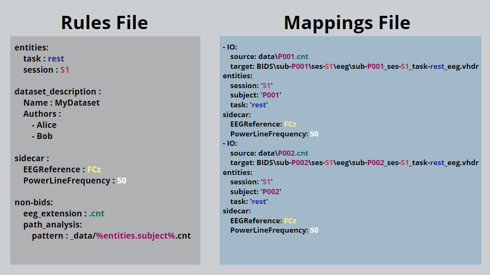

# Summary

Electroencephalography (EEG) recordings are stored in many vendor-specific formats and lab-specific folder structures, making them difficult to organize, share, or compare across studies. SOVABIDS is an open-source tool that converts EEG data into the Brain Imaging Data Structure (BIDS) [@bids], a standard that promotes FAIR data practices (Findability, Accessibility, Interoperability, and Reusability). Rather than manually renaming files or writing dataset-specific scripts, users define conversion rules in human-readable YAML configuration files, which SOVABIDS applies across the dataset (\autoref{fig:use}). It can be used as a Python package, a command-line tool, or an experimental terminal user interface (TUI), and its API supports integration with graphical frontends. Documentation and tutorials are available at [sovabids.readthedocs.io](https://sovabids.readthedocs.io/en/latest/README.html).

# Statement of need

EEG is a widely used neuroimaging technique, with applications in cognitive neuroscience, clinical diagnostics, brain-computer interfaces, and neuroengineering. As EEG datasets grow in volume and complexity, reproducibility, standardization, and interoperability have become priorities. The EEG extension of BIDS (EEG-BIDS) [@eegbids] provides a consistent framework for organizing EEG datasets, facilitating data sharing [@openneuro], cross-study comparison, and FAIR data practices [@fairdata].

Despite these advantages, converting EEG datasets to BIDS remains challenging. EEG formats vary across hardware vendors, and datasets are often organized by lab-specific or acquisition-driven conventions rather than a consistent structure. For researchers without strong programming backgrounds, particularly at less well-resourced institutions, conversion typically requires substantial manual effort or dataset-specific scripts, both error-prone and difficult to reproduce or scale to large multi-participant studies. SOVABIDS addresses this gap with a rule-based, semi-automated workflow that is accessible to users with limited programming experience yet flexible enough for the heterogeneity of real-world EEG datasets.

# State of the Field

Several tools support EEG conversion to BIDS, including MNE-BIDS [@mnebids], data2bids in FieldTrip [@fieldtrip], EEG-BIDS in EEGLAB [@eeglab], EEG2BIDS [@eeg2bids], and general-purpose, multi-modality converters such as Bidsme [@bidsme].

MNE-BIDS provides a programmatic interface within the MNE ecosystem with fine-grained control over metadata, but typically requires dataset-specific scripting, which limits accessibility for users without programming experience.

FieldTrip and EEGLAB integrate conversion into their analysis environments, convenient for existing users, but these workflows often still require manual interaction or scripting for each dataset.

EEG2BIDS offers a more guided workflow but relies on detailed file-level user input, which becomes impractical for large heterogeneous datasets.

Bidsme [@bidsme] is a general-purpose, YAML-configured converter whose preparation step derives subject and session labels from folder names or file metadata; other naming conventions require user-written Python plugins.

A natural question is whether SOVABIDS' goals could have been achieved by contributing to an existing tool, particularly MNE-BIDS. We argue this was impractical. In MNE-BIDS, conversion logic is written in Python, and adding rule-based, configuration-driven automation as a non-breaking extension would require architectural changes that diverge from its scripting-oriented design. FieldTrip and EEGLAB face the same barrier, as conversion is tightly coupled to their analysis environments.

SOVABIDS instead introduces an explicit two-tier separation between dataset-level rules and file-level mappings, encoded in human-readable YAML configuration files. Like other tools, it requires dataset-specific configuration, but this is defined once at the dataset level and expanded into file-level mappings, removing the need for per-file scripting. Combined with a semi-automatic API for extracting BIDS entities from file paths, this lets SOVABIDS handle the heterogeneous directory structures and vendor-specific naming conventions of real-world EEG datasets. The YAML approach has a modest learning curve but offers a declarative alternative to general-purpose scripting.

# Software Design

SOVABIDS' central design tension is between expressiveness and accessibility: more expressive conversion logic typically requires programming skill, while simpler interfaces tend to sacrifice flexibility. The five design principles below describe the resulting trade-offs.

## 1. Accessibility for non-technical users

A scripting-based interface, as used by tools like MNE-BIDS, offers greater expressiveness but requires users to write and maintain dataset-specific code. SOVABIDS trades this expressiveness for accessibility by using YAML configuration files, an approach inspired by the MRI converter Bidscoin [@bidscoin]. YAML configurations are reusable across similar datasets and auditable without programming knowledge. Highly unusual conversion scenarios may require more verbose configuration, but for many EEG datasets the YAML-based approach is sufficient and more approachable than writing a custom script.

## 2. Automation that can accommodate outliers

EEG experiments typically record each participant in the same way, but in practice data organization often varies slightly between participants (technical issues, partial recordings, or repeated segments). A fully automated system that assumes identical structure can fail silently in these cases, while a fully manual one would not scale. SOVABIDS therefore separates conversion logic into two configuration files (\autoref{fig:cfg}):

- The [Rules File](https://sovabids.readthedocs.io/en/latest/rules_schema.html), which encodes general conversion rules for the full dataset.
- The [Mappings File](https://sovabids.readthedocs.io/en/latest/mappings_schema.html), populated from the Rules File, which holds specific conversion parameters for every individual file.

This two-tier approach is inspired by MRI tools such as Bidscoin [@bidscoin] and HeuDiConv [@heudi]. It generates a separate mapping for each file, which users can review and edit, directly or through an external GUI connected via SOVABIDS' API, when a participant's data does not follow the general structure. Users can also start from an existing Rules File shared within a lab or community.

SOVABIDS infers subject, session, task, and other BIDS entities from file paths through a semi-automatic API. Rather than requiring data to be pre-organized into a standard folder hierarchy, as Bidscoin does, it uses patterns defined once at the dataset level and applied across selected files. Patterns take three increasingly technical forms: paired source-target examples, placeholder-based templates, or full regular expressions.

## 3. Reproducible conversion

Reproducibility requires that a conversion be specified by its saved configuration, not by undocumented manual steps. The rules and per-file mappings are saved and each run is logged, so users can audit, correct, and re-run conversions when a BIDS validator flags issues or downstream analysis reveals incorrect metadata.

## 4. Accessible interfaces and interoperability

SOVABIDS provides two further access paths beyond the CLI and Python API, targeting different user needs and deployment environments.

The first is an experimental, optional terminal user interface (TUI), launched via the `sovatui` command (installed with the `sovabids[tui]` extra), which guides users through the full conversion workflow in four steps (Setup, Rules, Mappings, and Convert) without requiring any code. A TUI was chosen over web-based and native GUI alternatives for its portability, small dependency footprint, and lower maintenance burden. It runs wherever a terminal is available, including over SSH on HPC clusters and remote servers where large-scale EEG processing often takes place. It adds a single pure-Python dependency, the `textual` library, rather than the large binary dependencies of native toolkits such as Qt. Finally, it avoids the packaging pipelines, frontend toolchains, and platform-specific bugs that web and native GUIs accumulate. A walkthrough is available at [https://youtu.be/dOWiMTuGvAA](https://youtu.be/dOWiMTuGvAA).

For external integration, SOVABIDS exposes an RPC-based API that lets external applications interact with its conversion logic. RPC was chosen over REST because its action-oriented design maps naturally onto the procedural steps of a data conversion workflow. To demonstrate the API's usability, an [experimental reference web GUI was developed in Flask](https://sovabids.readthedocs.io/en/latest/auto_examples/gui_example.html) and is available as a working [example](https://www.youtube.com/watch?v=PW84cy6uUJs). This path is intended for platforms that wish to embed SOVABIDS in a richer desktop or web frontend.

## 5. Format support through MNE delegation

Supporting the full range of EEG hardware formats from scratch would be an ongoing maintenance burden disproportionate to the tool's core contribution. SOVABIDS instead delegates file reading entirely to MNE-Python [@mne], and BIDS-compliant saving to MNE-BIDS [@mnebids], inheriting the input formats MNE can read. The trade-off is that SOVABIDS' format coverage is bounded by MNE's, but this is an acceptable constraint given MNE's broad and actively maintained format support. In practice, SOVABIDS has been tested with BrainVision (.vhdr), EDF (.edf), EEGLAB (.set), and FIF (.fif) as input formats, converting each to BrainVision output by default (or FIF for MEG). Other formats that MNE can read (Neuroscan .cnt, BDF, KIT, and CTF) are handled through the same MNE delegation but are not independently tested in SOVABIDS' continuous integration suite. Basic MEG datatype routing is implemented, but MEG-specific BIDS requirements (empty-room recordings, manufacturer calibration files, and digitization coordinate systems) are not currently exposed through SOVABIDS' rule system and must be handled manually.

## Architecture Overview

The five design principles above are reflected directly in SOVABIDS' two-module architecture, illustrated in \autoref{fig:arch}. The Rules Module takes the user-defined Rules File and applies it across all EEG files in the dataset, extracting conversion parameters and compiling them into a Mappings File. This separation means that general conversion logic and participant-specific details are handled in distinct artifacts rather than embedded in code. The Conversion Module then reads the Mappings File and performs the actual transformation to BIDS-compliant output, delegating file reading to MNE and BIDS-compliant saving to MNE-BIDS. Users can interact with both modules through the CLI, the Python API, or the experimental TUI. At either stage, the RPC API additionally allows external tools and GUIs to inspect or modify the configuration, supporting the supervised adjustment workflows described above.

![The architecture of SOVABIDS. The conversion process starts with a user-defined Rules File, which encodes general conversion rules (represented in blue inside the Rules File). The Rules Module processes these rules to generate a Mappings File, which contains specific configurations for all EEG files (each red line in the Mappings File represents the configuration of a different file). The Conversion Module then applies these configurations to produce a BIDS-compliant dataset. Interoperability is enabled via an RPC API, allowing integration with external tools, including graphical user interfaces for optional user-supervised adjustments.\label{fig:arch}](arch.png)

# Research Impact Statement

SOVABIDS is listed in the [official BIDS converter registry under the EEG/MEEG/iEEG category](https://bids.neuroimaging.io/tools/converters.html). It is also available on the Neurodesk platform [www.neurodesk.org](https://www.neurodesk.org) [@neurodesk; @Dao2025], a community-maintained open neuroimaging environment, which broadens its accessibility beyond the development team.

Its use has been documented in peer-reviewed and academic work: a Master's thesis on EEG-based Alzheimer's risk classification [@vero], a Bachelor's thesis on web-based EEG processing tools [@luisa], and a peer-reviewed study on harmonizing EEG features across multiple recording sites [@alberto].

# Acknowledgements

The authors acknowledge the support from the 2021 Google Summer of Code program under the International Neuroinformatics Coordinating Facility (INCF) organization, and the funding provided by the Australian Research Data Commons (ARDC) to support the Australian Electrophysiology Data Analytics Platform (AEDAPT). The authors also acknowledge the facilities and the scientific and technical assistance of the National Imaging Facility, a National Collaborative Research Infrastructure Strategy (NCRIS) capability, at Swinburne Neuroimaging, Swinburne University of Technology, and at the Centre for Advanced Imaging, The University of Queensland.

# AI Usage Disclosure

The primary architecture and core functionality of this software were completed prior to December 2023. Generative AI tools were not used in the conceptual design, methodological decisions, or scientific development of the project.

Since March 2025, generative AI tools, mainly OpenAI Codex and Claude Code (with models from GPT-4.1 and Claude 4.6 onward), were used for maintenance and supporting work: the experimental TUI and its tests, continuous-integration workflows, documentation, a utility for generating random 1/f signals, fixes during the JOSS review, and editing of this paper.

All AI-assisted outputs were reviewed, tested, and validated by the authors, who made all design decisions and scientific judgments.

# References