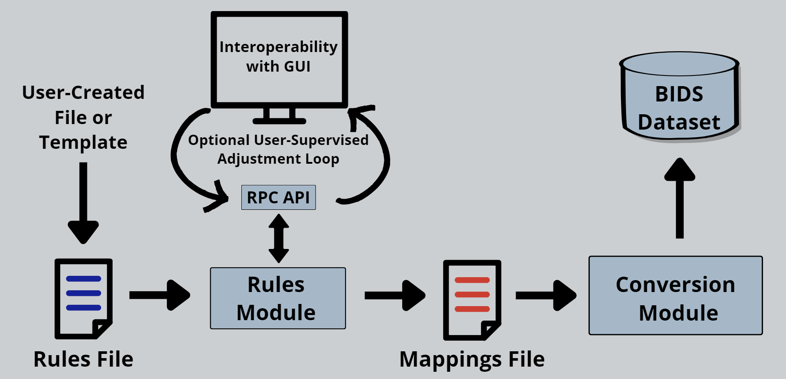

# Summary

The Brain Imaging Data Structure (BIDS) is a groundbreaking standard in neuroimaging research, aimed at simplifying the organization and sharing of neuroimaging and electrophysiological data [@bids]. Developed by a community of researchers and practitioners, BIDS provides a set of guidelines and best practices for the formatting and labeling of data files and folders in a consistent and understandable manner. This standardization is crucial in a field characterized by complex datasets and diverse analysis methods, as it enables researchers to more easily validate, share, and reuse data, thereby enhancing collaborative efforts and reproducibility in neuroimaging research.

Despite its advantages, the adoption of BIDS can be challenging, especially for researchers who are not well-versed in technical data manipulation or for those dealing with large and diverse datasets, such as those generated from electroencephalography (EEG) studies. EEG, a non-invasive method for measuring brain activity, generates substantial amounts of data that can be difficult to manage and convert into a standardized format without considerable effort.

This is where SOVABIDS steps in as a vital tool. SOVABIDS addresses the gap between the complexity of raw EEG data and the need for standardization as per the BIDS guidelines. Designed to be user-friendly, SOVABIDS enables the reproducible semi-automatic and interoperable conversion of EEG datasets into the BIDS standard, even by non-technical users. This not only democratizes access to BIDS compliance but also ensures that more EEG data can be shared and analyzed within the broader scientific community. Moreover, SOVABIDS facilitates the development of graphical frontends, which further enhances its accessibility to a wider audience, including those who may not be familiar with programming or data structuring concepts. Additionally, SOVABIDS integrates with established tools such as MNE [@mne] for reading EEG data formats and MNE-BIDS [@mnebids] for BIDS compliant data saving, thereby harnessing their robust capabilities. It also incorporates open-source best practices like automated testing and [streamlined documentation](https://sovabids.readthedocs.io/en/latest/autoapi/index.html) that includes [usage examples](https://sovabids.readthedocs.io/en/latest/auto_examples/index.html), ensuring continuous enhancement and facilitating community usage and collaboration in maintaining and improving the software. Furthermore, SOVABIDS has been used in some EEG (electroencephalography) web platforms [@luisa], has become a part of the [AEDAPT ecosystem](www.aedapt.net), and is available in the Neurodesk platform (www.neurodesk.org) [@neurodesk].

# Statement of need

The Brain Imaging Data Structure (BIDS) primarily provides a vendor-independent standard for organizing the raw data and associated metadata from brain imaging devices, such as MRI and electroencephalography (EEG), into a structured folder hierarchy with sidecar files [@bids] (\autoref{fig:use}). It helps with data sharing [@openneuro] and reusability [@bidsapps], thus promoting FAIR data practices [@fairdata] in diverse research fields. Examples include clinical studies like Alzheimer's disease, fundamental research in cognitive neuroscience, and artistic explorations of the brain's response to music. BIDS has recently gained popularity within the EEG community [@eegbids] as it allows the exchange of data and analysis pipelines between labs that use different types of EEG systems and protocols -- an important requirement for large-scale studies and clinical trials. That said, because BIDS is a new standard, brain imaging devices still save data in native formats, and researchers are obliged to perform a conversion to BIDS post data acquisition. Converting EEG data to BIDS is not technically difficult but involves substantial effort and is prone to error if done manually, which poses particular problems for large studies. Software solutions are available to assist the conversion, but they require either basic programming skills -e.g. MNE-BIDS [@mnebids]- or detailed user input per converted file, again limiting practicality for large studies -e.g. EEG2BIDS [@eeg2bids]-. Given this, SOVABIDS was designed with the following five constraints and solutions in mind:

## 1. Adoption by non-technical users

To maximise software adoption, step-by-step guides for SOVABIDS are provided. Moreover, to decrease the need of programming skills the conversion uses human-readable YAML configuration files rather than a scripting language (the approach was adopted from Bitcoin [@bidscoin], a BIDS converter for MRI data).

## 2. Automation and the handling of outliers

The planned output of EEG experiments is multiple identically-organised data structures,  typically one for each participant. Nevertheless, in practice data organisation often varies slightly between participants; for example, due to temporary technical issues, the data recorded for some participants might be partial. Similar to other conversion tools [@bidscoin,@heudi], we leverage the generally similar data organisation across participants, but we extend this by allowing for non-identical data structures. This is done by utilising two configuration files (\autoref{fig:cfg}): 1) The [Rules File](https://sovabids.readthedocs.io/en/latest/rules_schema.html), which encodes the general conversion rules for a multiple-participant EEG dataset; and 2) The [Mappings File](https://sovabids.readthedocs.io/en/latest/mappings_schema.html), which is derived from the Rules File, and holds specific conversion rules for every individual participant. For increased automation, SOVABIDS also implements heuristics to exploit the common file path patterns used in EEG research. In addition, the user can derive the initial Rules File from a community or institutional template, further decreasing manual input. For more fine-tuning of special cases, a user-supervised adjustment loop can be set up through the interoperable API to connect to an external GUI, allowing for fast manual inputs when a fully automated generation is not possible.

## 3. Reproducible conversion

All the parameters needed to fully replicate the conversion are saved in the configuration files along with provenance information. This allows the user to evaluate, correct and repeat the conversion in case the BIDS-organised dataset has an invalid structure (as detected using a BIDS validator) or incorrect content (usually discovered during the analysis stage).

## 4. Interoperability

To increase maintainability, SOVABIDS does not include a graphical user interface (GUI), but its API allows interoperability with other applications, primarily GUI front ends (desktop or web-based). We used an RPC protocol as action-oriented methods naturally adjust to a conversion process. To [demonstrate](https://www.youtube.com/watch?v=PW84cy6uUJs) the usability of the API, a [basic GUI was developed in Flask](https://sovabids.readthedocs.io/en/latest/auto_examples/gui_example.html).

## 5. Broad support of formats and reusing available software

Leveraging the reading of electrophysiology files through MNE, SOVABIDS can be extended to allow the conversion of many different formats. As of now, the software has been tested with BrainVision (.vhdr) and Neuroscan (.cnt) files.

# Software Architecture

The software architecture of [SOVABIDS](https://sovabids.readthedocs.io) is designed to streamline the process of converting EEG datasets to the BIDS format. As depicted in \autoref{fig:arch}, the system is built around two core modules that work in tandem to simplify this complex task:
Rules Module: At the heart of SOVABIDS, the Rules Module is where the logic of conversion is enacted. Users define specific rules which the module applies to target EEG files, meticulously extracting and compiling conversion parameters into a 'Mappings File'. This file becomes the blueprint for the subsequent data transformation process, ensuring that the individualized nuances of each EEG file are accounted for. These nuances can be introduced through the interoperation with GUIs by leveraging the RPC API.
Conversion Module: Acting upon the 'Mappings File', this module is responsible for the hands-on task of converting raw EEG data into the BIDS format. It’s a crucial step that translates the preparatory work done by the Rules Module into a structured dataset aligned with the stringent requirements of the BIDS standard, allowing for better interoperability and reproducibility of research.

# Acknowledgements

The authors acknowledge the support from the 2021 Google Summer of Code program under the International Neuroinformatics Coordinating Facility (INCF) organization, and by the Australian Research Data Commons (ARDC). The authors also acknowledge the facilities and scientific and technical assistance of the National Imaging Facility, a National Collaborative Research Infrastructure Strategy (NCRIS) capability, at Swinburne Neuroimaging, Swinburne University of Technology, and at the Centre for Advanced Imaging, The University of Queensland.

# References